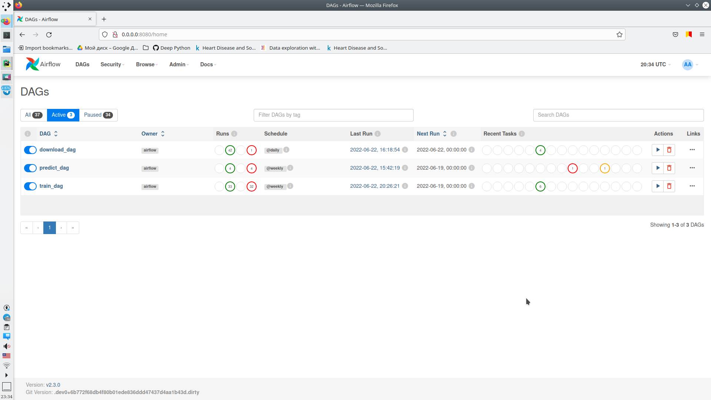
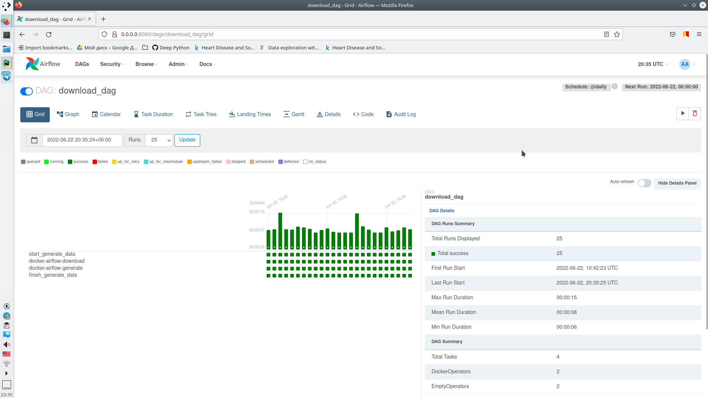
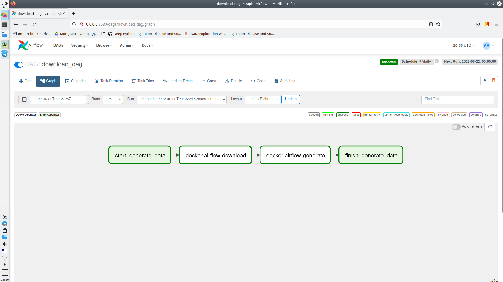
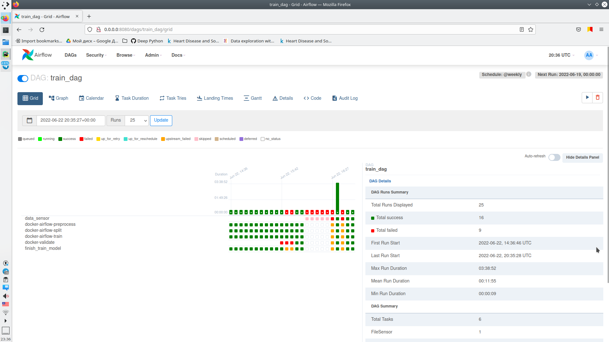
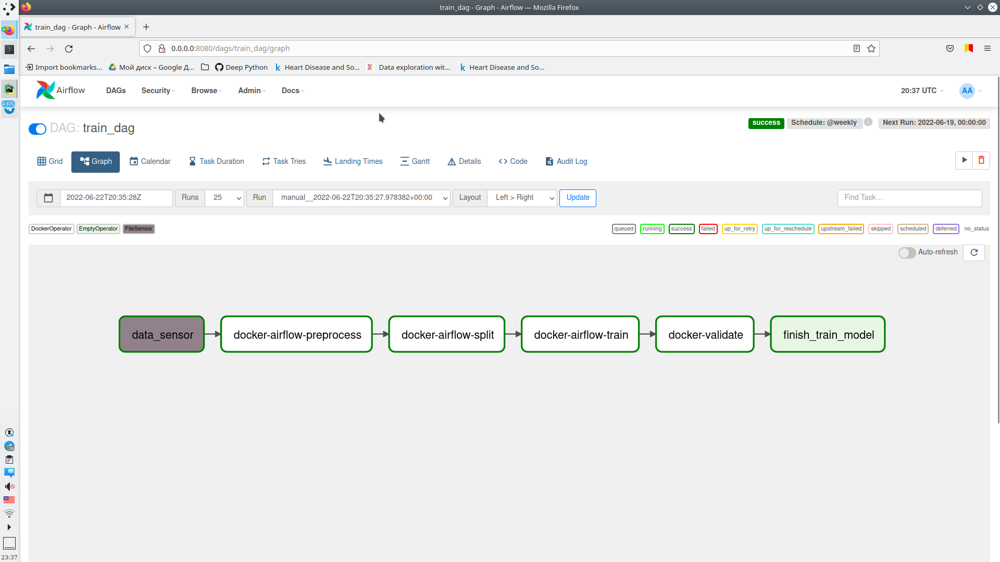
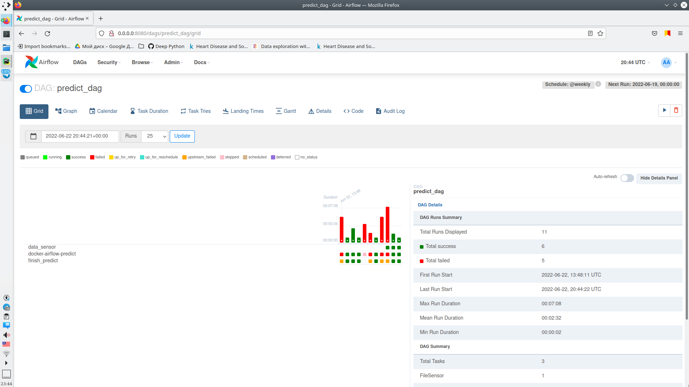
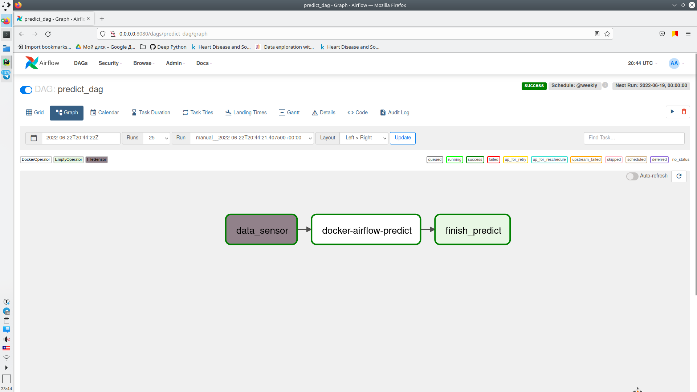

# Homework3

### To work correctly with variables created from the UI:
~~~
export FERNET_KEY=$(python -c "from cryptography.fernet import Fernet; FERNET_KEY = Fernet.generate_key().decode(); print(FERNET_KEY)")
~~~

### To build and launch airflow:
~~~
docker-compose up --build
~~~

### For the correct operation of dags:
* you need to create a File (path) connection in **airflow** with the name `fs_default`

----
### Самоооценка:

1. Реализуйте dag, который генерирует данные для обучения модели **(5/5)**
2. Реализуйте dag, который обучает модель еженедельно, используя данные за текущий день - 4 стадии **(10/10)**
3. Реализуйте dag, который использует модель ежедневно **(5/5)**
4. Реализация через DockerOperator **(5/5)**
5. Cамооценка **(1/1)**

Дополнительная часть:

6. Реализуйте сенсоры на то, что данные готовы для дагов тренировки и обучения **(3/3)**
7. Тесты **(4/5)**

**33*0.6=19.8**