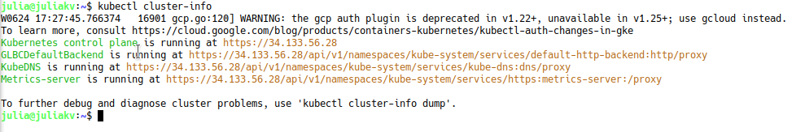
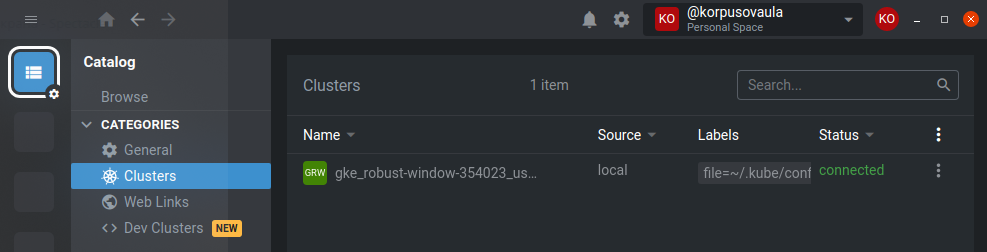
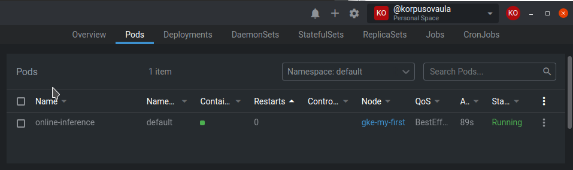
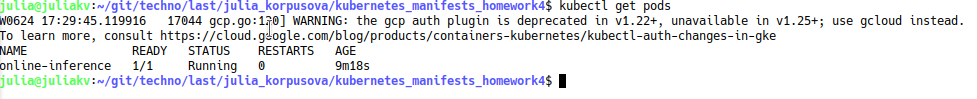
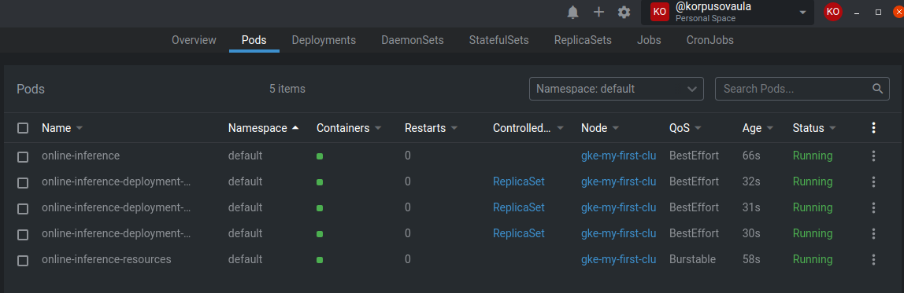

# Homework 4 
____
#### Запуск kuberctl (работа с приложением online-inference)
Для работы наобходимо установить порты 
```
kubectl port-forward pod/fastapi-ml 7070:8080
```
Запустить из папки kubernetes_manifests_homework4
```
Deploy: kubectl apply -f online-inference-pod-predict.yaml
```
Запустить из папки online_inference
```
python make_request.py
```
_____
## Installation
* Kubernetes развернут в облаке через функционал https://cloud.google.com/kubernetes-engine
```
kubectl cluster-info
```

* Далее для работы с кластером использую Lens


## Запуск и проверка
```
kubectl apply -f online-inference-pod.yaml
kubectl get pods
```



## Requests / Limits
* Request устанавливаем для того, чотбы установить необходимые ресурсы для приложения. При отсутствии необходимого ресурса приложение будет ждать освобождения 
* Limits устанавливаем для ограничения приложение потребляемого ресерса

## Liveness / Readiness
* Liveness - устанавлиет время ожидания запуска приложения перед перезапуском
* Readiness - устанавлиет время ожидания до момента когда приложение готово принимать запросы
* Установив Liveness / Readiness мы предотвращаем перезапуск приложения
* online-inference:v2 опубликована в репозитории docker: https://hub.docker.com/repository/registry-1.docker.io/juliakorp/online_model/tags?page=1&ordering=last_updated

## ReplicaSet
При смене docker образа в манифесте и одновременно с этим:
* уменьшить число реплик, то останутся только старые реплики
* увеличить число реплик, то старые реплики дополнятся новыми


________
### Самооценка

0. Установите `kubectl`
1. Разверните Kubernetes (5/5)
2. Напишите простой вашего приложения, назовите его `online-inference-pod.yaml` (4/4)
3. Пропишите Requests / Limits и напишите, зачем это нужно в описании PR. Закоммитьте файл `online-inference-pod-resources.yaml` (2/2)
4. Модифицируйте свое приложениt. Добавьте Liveness и Readiness пробы и посмотрите, что будет происходить. Напишите в описании -- чего вы этим добились. Закоммитьте отдельный манифест `online-inference-pod-probes.yaml` (и изменение кода приложения). Опубликуйте ваше приложение (из ДЗ #2) с тэгом `v2` (3/3)
5. Создайте [ReplicaSet] сделайте 3 реплики вашего приложения. Закоммитьте `online-inference-replicaset.yaml` (3/3)
6. Опишите [Deployment] для вашего приложения (3/3)
__________
**20**